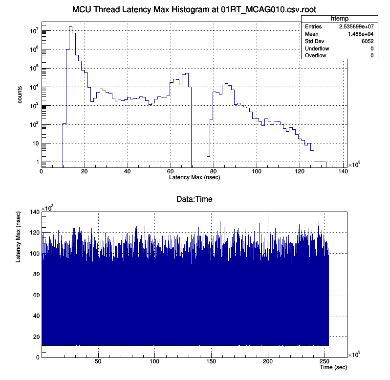

Beckhoff CPU : CX5130
===

## The Baseline Configuration Latency Result

 
* Data sample : 25356987
* Mean : 14661.6 nsec
* Sample deviation : 6052.04 nsec
* Standard deviation : 6052.04 nsec


||
| :---: |
|**Figure 1** Beckhoff CPU CX5130 Latency Max Plots. |


## CPU Information
```
processor	: 0
vendor_id	: GenuineIntel
cpu family	: 6
model		: 55
model name	: Intel(R) Atom(TM) CPU  E3827  @ 1.74GHz
stepping	: 9
microcode	: 0x90c
cpu MHz		: 1747.200
cache size	: 512 KB

```

## E3 IOC Information

```
# Start at "2019-W51-Dec20-1229-41-CET"
#
# Version information:
# European Spallation Source ERIC : iocsh.bash (0.4.1-7aa3226.PID-1903)
#
# --->--> snip -->--> 
# Please Use Version and other environment variables
# in order to report or debug this shell
#
# HOSTDISPLAY=""
# WINDOWID=""
# PWD="/home/iocuser/ecmccfg/examples/mcu1026"
# USER="iocuser"
# LOGNAME="iocuser"
# EPICS_HOST_ARCH="linux-x86_64"
# EPICS_BASE="/epics/base-7.0.3"
# E3_REQUIRE_NAME="require"
# E3_REQUIRE_VERSION="3.1.2"
# E3_REQUIRE_LOCATION="/epics/base-7.0.3/require/3.1.2"
# E3_REQUIRE_BIN="/epics/base-7.0.3/require/3.1.2/bin"
# E3_REQUIRE_DB="/epics/base-7.0.3/require/3.1.2/db"
# E3_REQUIRE_DBD="/epics/base-7.0.3/require/3.1.2/dbd"
# E3_REQUIRE_INC="/epics/base-7.0.3/require/3.1.2/include"
# E3_REQUIRE_LIB="/epics/base-7.0.3/require/3.1.2/lib"
# E3_SITEAPPS_PATH="/epics/base-7.0.3/require/3.1.2/siteApps"
# E3_SITELIBS_PATH="/epics/base-7.0.3/require/3.1.2/siteLibs"
# E3_SITEMODS_PATH="/epics/base-7.0.3/require/3.1.2/siteMods"
# EPICS_DRIVER_PATH="/epics/base-7.0.3/require/3.1.2/siteMods:/epics/base-7.0.3/require/3.1.2/siteApps"
# EPICS_CA_AUTO_ADDR_LIST=""
# EPICS_CA_ADDR_LIST=""
# PATH="/epics/base-7.0.3/require/3.1.2/bin:/epics/base-7.0.3/bin/linux-x86_64:/usr/local/bin:/usr/bin:/usr/local/sbin:/usr/sbin:/home/iocuser/.local/bin:/home/iocuser/bin"
# LD_LIBRARY_PATH="/epics/base-7.0.3/lib/linux-x86_64:/epics/base-7.0.3/require/3.1.2/lib/linux-x86_64:/epics/base-7.0.3/require/3.1.2/siteLibs/linux-x86_64"
# --->--> snip -->--> 
```


## How to split the root file more than 100MiB
```
split -b 90M 01RT_MCAG010.csv.root
```
Rename them via
```
mv xaa xaa_01RT_MCAG010.csv.root
mv xab xab_01RT_MCAG010.csv.root
mv xac xac_01RT_MCAG010.csv.root
```

## How to merge the splited files into one root file

```
cat xa* > 01RT_MCAG010.csv.root
```

## `rt_check`

```
iocuser@mcu010: realtime-config (master)$ ./rt_check.bash 

>>> Boot Cmdline 
BOOT_IMAGE=/vmlinuz-3.10.0-1062.9.1.rt56.1033.el7.x86_64 root=/dev/mapper/centos-root ro crashkernel=auto rd.lvm.lv=centos/root rd.lvm.lv=centos/swap idle=poll intel_idle.max_cstate=0 processor.max_cstate=1 skew_tick=1 LANG=en_US.UTF-8 isolcpus=0 intel_pstate=disable nosoftlockup skew_tick=1

>>> pidstat -C isolcpus
Linux 3.10.0-1062.9.1.rt56.1033.el7.x86_64 (mcu010) 	12/23/2019 	_x86_64_	(2 CPU)

11:35:10 AM   UID       PID    %usr %system  %guest    %CPU   CPU  Command

>>> Present CPU core 
0-1

>>> Isolated CPU core 
0

>>> System service : irqbalance
● irqbalance.service - irqbalance daemon
   Loaded: loaded (/usr/lib/systemd/system/irqbalance.service; disabled; vendor preset: enabled)
   Active: inactive (dead)

>>> System service : tuned
● tuned.service - Dynamic System Tuning Daemon
   Loaded: loaded (/usr/lib/systemd/system/tuned.service; enabled; vendor preset: enabled)
   Active: active (running) since Fri 2019-12-20 12:20:57 CET; 2 days ago
 Main PID: 1467 (tuned)
   CGroup: /system.slice/tuned.service
           └─1467 /usr/bin/python -Es /usr/sbin/tuned -l -P

Dec 20 12:20:55 mcu010 systemd[1]: Starting Dynamic System Tuning Daemon...
Dec 20 12:20:57 mcu010 systemd[1]: Started Dynamic System Tuning Daemon.

    Tune Active Profile 
Current active profile: realtime

    Tune Realtime variable 

isolated_cores=0
# isolated_cores=2,4-7
# isolated_cores=2-23
#

    Tune Realtime bootcmdline
TUNED_BOOT_CMDLINE="isolcpus=0 intel_pstate=disable nosoftlockup skew_tick=1"
TUNED_BOOT_INITRD_ADD=""

```
