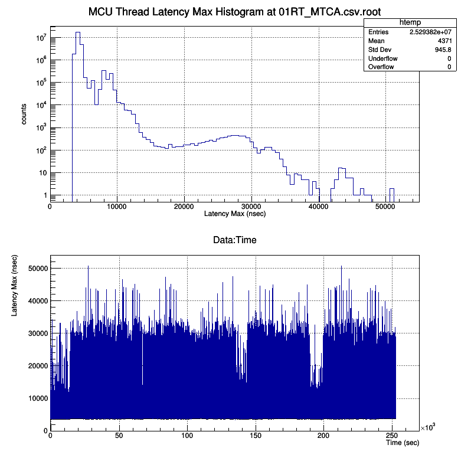

MTCA Concurrent CPU
===

## The Baseline Configuration Latency Result


* Data sample : 25293820
* Mean : 4371.00 nsec
* Sample deviation : 945.84 nsec
* Standard deviation : 945.84 nsec


||
| :---: |
|**Figure 1** MTCA Latency Max Plots. |


## CPU Information

```
processor	: 0
vendor_id	: GenuineIntel
cpu family	: 6
model		: 58
model name	: Intel(R) Core(TM) i7-3555LE CPU @ 2.50GHz
stepping	: 9
microcode	: 0x21
cpu MHz		: 2501.000
cache size	: 4096 KB
```

## E3 IOC Information

```
# ------>-----> snip ----->------> 
#
# Please Use Version and other environment variables
# in order to report or debug this shell
#
# The IOC is started at "2019-W51-Dec20-1212-19-CET"
#
# Version information:
# European Spallation Source ERIC : iocsh.bash (0.5.1-81d1214.PID-6362)
#
# HOSTDISPLAY=""
# WINDOWID=""
# PWD="/home/iocuser/e3-7.0.3.1/e3-ecmccfg/ecmccfg/examples/mcu1012"
# USER="iocuser"
# LOGNAME="iocuser"
# EPICS_HOST_ARCH="linux-x86_64"
# EPICS_BASE="/epics/base-7.0.3.1"
# E3_REQUIRE_NAME="require"
# E3_REQUIRE_VERSION="3.1.2"
# E3_REQUIRE_LOCATION="/epics/base-7.0.3.1/require/3.1.2"
# E3_REQUIRE_BIN="/epics/base-7.0.3.1/require/3.1.2/bin"
# E3_REQUIRE_DB="/epics/base-7.0.3.1/require/3.1.2/db"
# E3_REQUIRE_DBD="/epics/base-7.0.3.1/require/3.1.2/dbd"
# E3_REQUIRE_INC="/epics/base-7.0.3.1/require/3.1.2/include"
# E3_REQUIRE_LIB="/epics/base-7.0.3.1/require/3.1.2/lib"
# E3_SITEAPPS_PATH="/epics/base-7.0.3.1/require/3.1.2/siteApps"
# E3_SITELIBS_PATH="/epics/base-7.0.3.1/require/3.1.2/siteLibs"
# E3_SITEMODS_PATH="/epics/base-7.0.3.1/require/3.1.2/siteMods"
# EPICS_DRIVER_PATH="/epics/base-7.0.3.1/require/3.1.2/siteMods:/epics/base-7.0.3.1/require/3.1.2/siteApps"
# EPICS_CA_AUTO_ADDR_LIST="yes"
# EPICS_CA_ADDR_LIST=""
# PATH="/epics/base-7.0.3.1/require/3.1.2/bin:/epics/base-7.0.3.1/bin/linux-x86_64:/usr/local/bin:/usr/bin:/usr/local/sbin:/usr/sbin:/home/iocuser/.local/bin:/home/iocuser/bin"
# LD_LIBRARY_PATH="/epics/base-7.0.3.1/lib/linux-x86_64:/epics/base-7.0.3.1/require/3.1.2/lib/linux-x86_64:/epics/base-7.0.3.1/require/3.1.2/siteLibs/linux-x86_64"
#
# ------>-----> snip ----->------> 

require ecmc        "6.0.1"
```


```
## How to split the root file more than 100MiB
```
split -b 90M 01RT_MTCA.csv.root
```

## How to merge the splited files into one root file

```
cat xa* > test.root
```

## `rt_check`

```
iocuser@icslab-mtca-daq02: realtime-config (master)$ ./rt_check.bash 

>>> Boot Cmdline 
BOOT_IMAGE=/vmlinuz-3.10.0-1062.9.1.rt56.1033.el7.x86_64 root=/dev/mapper/centos_icslab--mtca--daq02-root ro rd.lvm.lv=centos_icslab-mtca-daq02/root rd.lvm.lv=centos_icslab-mtca-daq02/swap rhgb quiet idle=poll intel_idle.max_cstate=0 processor.max_cstate=1 skew_tick=1 isolcpus=0 intel_pstate=disable nosoftlockup skew_tick=1

>>> pidstat -C isolcpus
Linux 3.10.0-1062.9.1.rt56.1033.el7.x86_64 (icslab-mtca-daq02) 	12/23/2019 	_x86_64_	(4 CPU)

11:07:17 AM   UID       PID    %usr %system  %guest    %CPU   CPU  Command

>>> Present CPU core 
0-3

>>> Isolated CPU core 
0

>>> System service : irqbalance
● irqbalance.service - irqbalance daemon
   Loaded: loaded (/usr/lib/systemd/system/irqbalance.service; disabled; vendor preset: enabled)
   Active: inactive (dead)

>>> System service : tuned
● tuned.service - Dynamic System Tuning Daemon
   Loaded: loaded (/usr/lib/systemd/system/tuned.service; enabled; vendor preset: enabled)
   Active: active (running) since Fri 2019-12-20 11:43:00 CET; 2 days ago
 Main PID: 5006 (tuned)
    Tasks: 4
   CGroup: /system.slice/tuned.service
           └─5006 /usr/bin/python -Es /usr/sbin/tuned -l -P

Dec 20 11:43:00 icslab-mtca-daq02 systemd[1]: Starting Dynamic System Tuning Daemon...
Dec 20 11:43:00 icslab-mtca-daq02 systemd[1]: Started Dynamic System Tuning Daemon.

    Tune Active Profile 
Current active profile: realtime

    Tune Realtime variable 
isolated_cores=0
    Tune Realtime bootcmdline
TUNED_BOOT_CMDLINE="isolcpus=0 intel_pstate=disable nosoftlockup skew_tick=1"
TUNED_BOOT_INITRD_ADD=""
```
