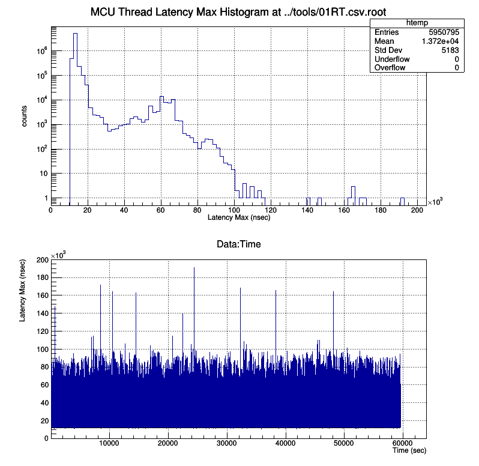
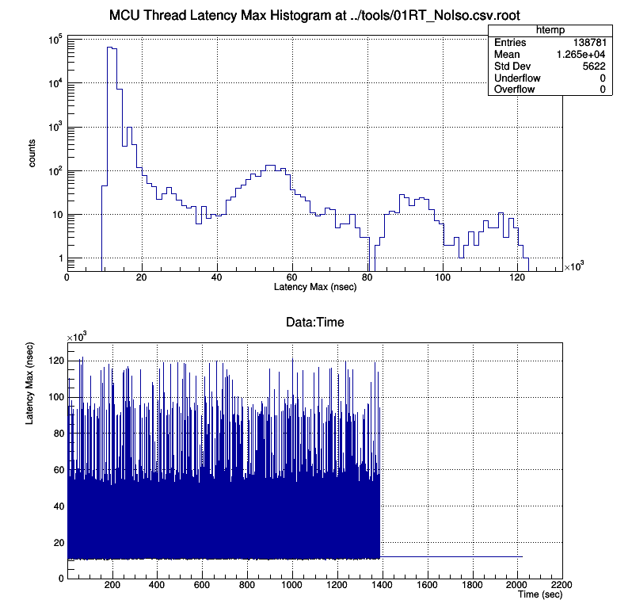

Identify the Baseline Configuration Test Results
===


```
irqbalance,tuned,profile,kernel,ecmc_rt,iocsh_rt,filename.csv,max latency +- sample dev
---
1,0,--,OK,72,0,10--OK72.csv   ,6669002 / 12690.6047 +- 3236.0986 ns 
0,1,RT,OK,72,0,01RTOK72.csv   , 763125 / 13927.6578 +- 3451.2761 ns
0,1,LP,OK,72,0,01LPOK72.csv   , 400522 / 14271.1271 +- 3994.9727 ns 
0,1,LP,OK,72,1,01LPOK72_rt.csv, 416013 / 13694.62 +- 3621.05 ns
---
1,0,--,OK,90,0,10--OK90.csv
0,1,RT,OK,90,0,01RTOK90.csv
0,1,LP,OK,90,0,01LPOK90.csv
1,0,--,OK,90,1,10--OK90_rt.csv
0,1,RT,OK,90,1,01RTOK90_rt.csv
0,1,LP,OK,90,1,01LPOK90_rt.csv
```


# irqbalance = 1

```
systemctl start irqbalance
systemctl stop tuned
```

# tuned = 1

```
systemctl stop irqbalance
systemctl start tuned
```

## RT
The tuned  realtime profile with `isolated_cores=0` configuration.

```
nano /etc/tuned/realtime-variables.conf
tuned-adm profile realtime
```

# Kerenl = OK
```
cat /proc/cmdline
BOOT_IMAGE=/vmlinuz-3.10.0-1062.4.3.rt56.1029.el7.x86_64 root=/dev/mapper/centos-root ro crashkernel=auto rd.lvm.lv=centos/root rd.lvm.lv=centos/swap idle=poll intel_idle.max_cstate=0 processor.max_cstate=1 skew_tick=1
```

# iocsh = 1 
```
iocsh -rt cmd_file
```


## Interesting Examples with `isolated_cores`


We would like to test "realtime" profile with "no" isoloated_cores. So we pick
"non-existent" cores number 128 within 5 years at ESS. Without -, tuned-adm cannot
set that one into its configuration. 


### `isolated_cores=0`


||
| :---: |
|**Figure 1** Thread Latency Plot with `isolated_cores=0`. |


### `isolated_cores=128-`


||
| :---: |
|**Figure 2** Thread Latency Plot with`isolated_cores=128-`, which means we don't use `isolated_cores`. |


```

### Typical Setup Procedure

```
$ nano /etc/tuned/realtime-variables.conf

```

```
isolated_cores=0
```

```
$ tuned-adm profile realtime
$ cat /etc/tuned/bootcmdline
$ reboot

```


### After rebooting..

```
echo ">> /proc/cmdline"
cat /proc/cmdline
echo ""
echo ">>> pidstat -C isolcpus"
pidstat -C isolcpus
echo ""
echo ">>> present"
cat /sys/devices/system/cpu/present
echo ""
echo ">>> isolated"
cat /sys/devices/system/cpu/isolated
echo ""
echo ">>> tuned"
systemctl status tuned
echo ""
echo ">>> irqbalance"
systemctl status irqbalance


```

### After starting an IOC

`0` and `1` are the core number

```
pidstat |grep "   0  [a-z,A-Z,0-9]"
pidstat |grep "   1  [a-z,A-Z,0-9]"
```

