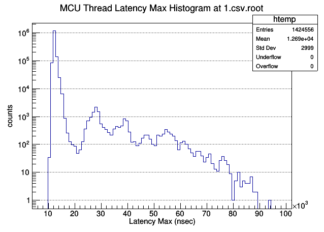
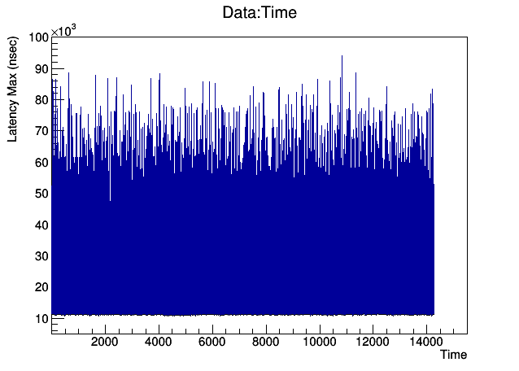
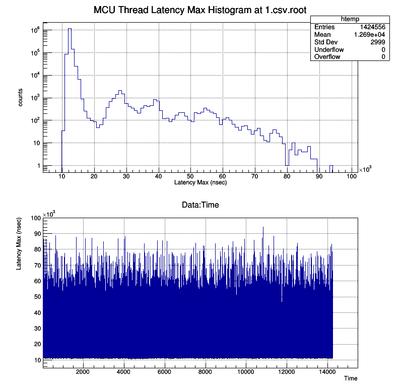

## Run the Running Average  and build a csv file for the post analysis 
```
camonitor -F, -t sr MCU1025:MCU-thread-latency-max | tee 1.csv | awk -f RunningAverage.awk
```

## Run the Running Average after we have `1.csv`

```
cat 1.csv | awk -f RunningAverage.awk
```


## Run ROOT to check it. 

Filename (csv file) must be matched with the above. Once we create `1.csv.root`, one doesn't need to create again. In this cae, one can specifiy each file within the plot function such as `plot(1000, 1, "filename")


```
$ root 
   ------------------------------------------------------------
  | Welcome to ROOT 6.18/04                  https://root.cern |
  |                               (c) 1995-2019, The ROOT Team |
  | Built for linuxx8664gcc on Oct 09 2019, 10:05:00           |
  | From tags/v6-18-04@v6-18-04                                |
  | Try '.help', '.demo', '.license', '.credits', '.quit'/'.q' |
   ------------------------------------------------------------

root [0] .L analyze.C 
root [1] saveRootFile("1.csv")
Warning in <TTree::ReadStream>: Ignoring trailing "-12-16 11:19:01.828597" while reading data for branch Time on line 1
******************************************************************************
*Tree    :tree      : a tree                                                 *
*Entries :  1424556 : Total =        72897520 bytes  File  Size =   10911804 *
*        :          : Tree compression factor =   6.67                       *
******************************************************************************
*Br    0 :PV        : PV/C                                                   *
*Entries :  1424556 : Total  Size=   50035752 bytes  File Size  =    3067642 *
*Baskets :     1741 : Basket Size=      32000 bytes  Compression=  16.29     *
*............................................................................*
*Br    1 :Time      : Time/D                                                 *
*Entries :  1424556 : Total  Size=   11430735 bytes  File Size  =    4021988 *
*Baskets :      356 : Basket Size=      32000 bytes  Compression=   2.83     *
*............................................................................*
*Br    2 :Data      : Data/D                                                 *
*Entries :  1424556 : Total  Size=   11430735 bytes  File Size  =    3822174 *
*Baskets :      356 : Basket Size=      32000 bytes  Compression=   2.98     *
*............................................................................*

root [0] .L analyze.C
root [1] saveRootFile("1.csv")
root [2] plotHist("1.csv.root")
root [3] plotTSGraph("1.csv.root")
root [4] plots("1.csv.root")
```

||
| :---: |
|**Figure 1** plotHist Canvas Example. |

||
| :---: |
|**Figure 2** plotTSGraph Canvas Example. |


||
| :---: |
|**Figure 3** plots Canvas Example. |


## Helps

Once `saveRootFile(filename)` function is called, the `filename.root` will be generated. After this, one doesn't need to call `saveRootFile`. Then, the commands are

```
root [0] .L analyze.C
root [2] plotHist("1.csv.root")
root [3] plotTSGraph("1.csv.root")
root [4] plots("1.csv.root")
```

One can look at what they are in `root` file via `TBrowser`.

```
$ root
root [0] new TBrowser
```


